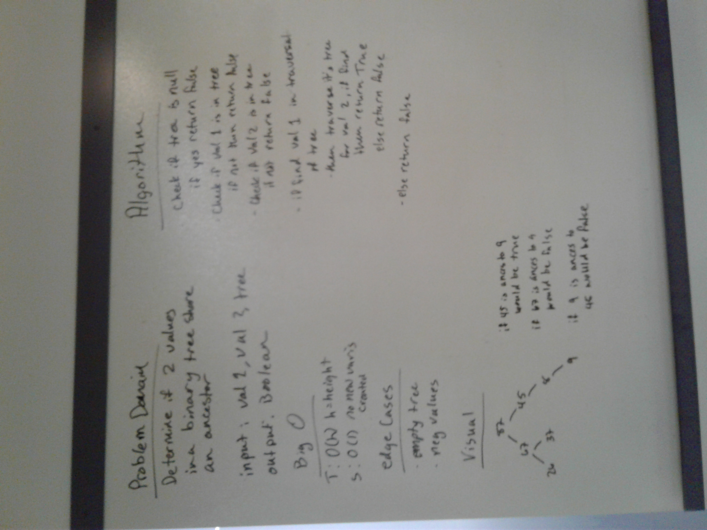
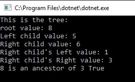
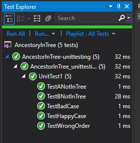

# Is Ancestor
We were challenged to determin if a value was an ancestor of another value in a binary tree
(A classical definition of ancestor nodes: “Any node present in the path from that node to the root node (including the root node))

## Challenge
We are given two values and a tree and must determine if the first value is an ancestor of the second value.
We were to return true or false. 
I chose breadth first because I couldn't figure out a way to pass the boolean up and down the recursion if I had chosen the depth first method.

## Approach & Efficiency
I added my dll from BreadthFirstTraversal to utilize the nodes/queues previously written.
I put each level into a queue. I then compared it to the first value, and if I then continued the search and if I came across the second then I would return out of the method, otherwise I continued to enqueued it's children
For time, it was Big O(n) because we would walk through all the nodes.
For space, it was Big O(w) where W is width, the width of the tree.

## Solution
WhiteBoard: 

Console: 

Tests:
