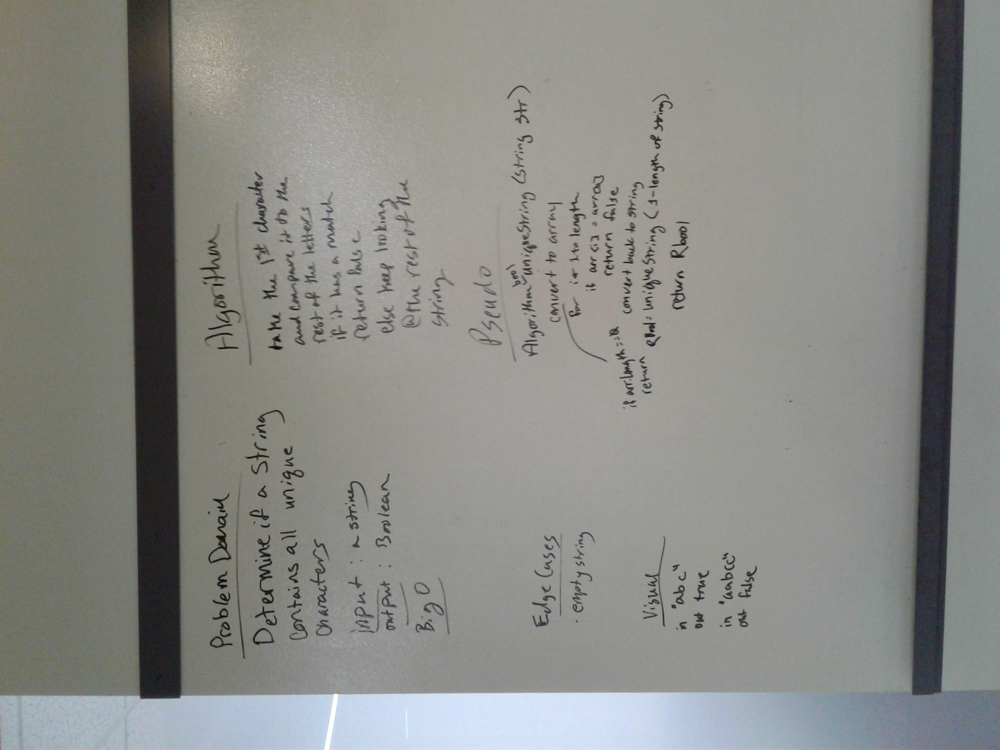
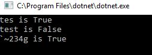
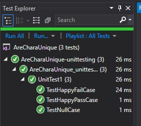

## Find if a string has only unique characters
We were asked to determine if a given string contained only unique characters

## Challenge
I chose to try doing this recursively. I shorten the string each time I passed through and then called the method with that shorten string.

## Approach & Efficiency
For time, I used Big O(n) because iterate through the whole string.
For space, I think I used Big O(n) because each call I created a new variable.

## Solution
WhiteBoard: 

Console: 

Tests:
