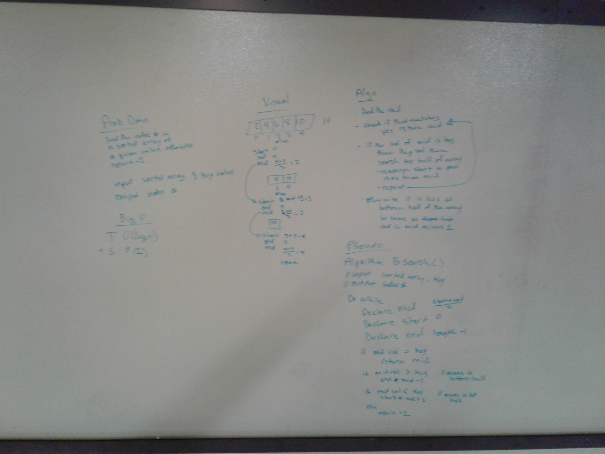

# Code Challenge: Binary Search
We are given a sorted array and a number, we are to binary-ily search through the array to find the index number of the given number, otherwise return -1 if it isn't in the array.

Partnered with Jason Few

## Solution
