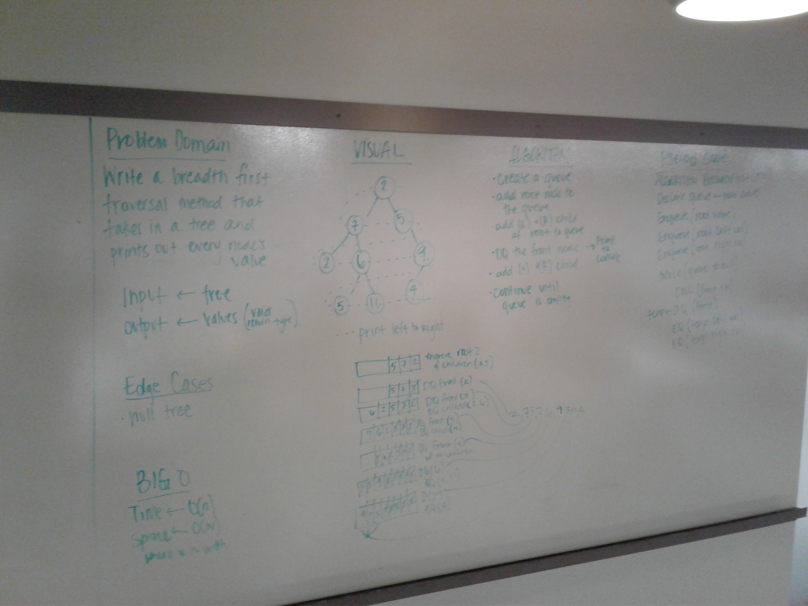
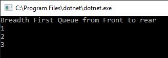
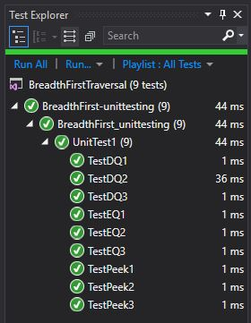

# Breadth-first
We were asked to write a method that printed the breadth first traversal of a tree.

## Challenge
Breadth first is reading nodes in a tree from top to bottom left to right (on each level) This was a challenge because say you are 5 levels deep and how does one keep track of the left to right reading when they are on multiple sepetate "branches" of the tree

## Approach & Efficiency
We put each level into a queue. We printed each "root" node and dequeued it, and enqueued it's children
For time, it was Big O(n) because we would walk through all the nodes.
For space, it was Big O(w) where W is width, the width of the tree.

## Solution
WhiteBoard: 

Console: 

Tests:

## Contribuitor
Partnered with Deziree Teague
