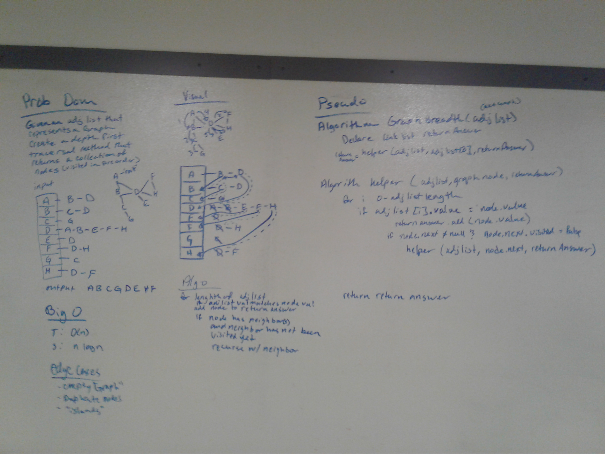

# Depth First Traversal
We were asked to write a method using depth first traversal of a graph using pre-order particularly (the graph was represented with as an  adjacency list).

## Challenge
The challenge to this was that depth first traversal means recursion to me. The method we were to write was only supposed to take in an adjacency list and return a collection.  I couldn't see how I could use recursion with just those two pieces. So I created a helper that I could use recursively.

## Approach & Efficiency
I utilized my Graph DLL.
I approached this by creating a helper method that would take in the adjacency list, a node, and a returnAnswer. This helper function was what I used to call itself recursively with a change of the node. I chose a linked list for the return answer because it is a reference type so it just returns the "pointer" to the list.
This has a Big O of N time because I would have to go through all the nodes
This has a Big O of V + E where v is vertexes and E are edges, for space or O of H where H is the height of the call stack. I think O V+E because I have to visit all the nodes and their edges, but I think Height of the callstack because of recursion. because 

## Solution
White board: 
