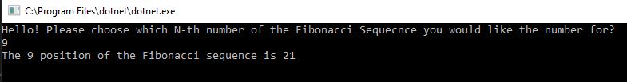
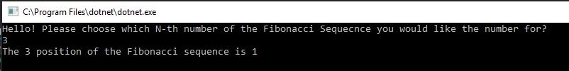
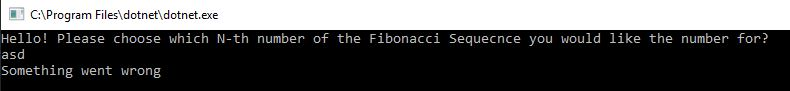
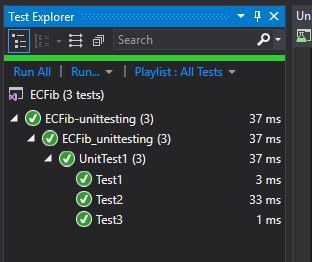

# Extra Credit: Fibonacci
We were offered extra credit to create a program that provides the Nth number of the fibonacci sequence (which is chosen by the user)

## Big O 
Time Big O is O(N) because I had to walk through each element in the array once.
Space Big O is O(N) because I created an array

## Solution

