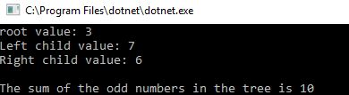
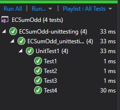

# Find the sum of all the odd numbers in a Binary Search Tree
We were offered extra credit to write the program for one of the mock interview questions. I chose to write the program for the first question: to find the sum of odd numbers in a Binary Search Treee

I assumed in my input was a tree, and my output was an integer.
Amanda Iverson stated we didn't need to submit a whiteboard with this extra credit

## Aproach and efficiency
For Time, I used a Big O(n) because I needed to still traverse all nodes even though this was a Binary Search Tree, the sort didn't help narrow down the selection
For Space, I used a Big O(w) where w is the width if the tree because I used the breadth traversal method, so my queue will be at it's widest point will be the same as the widest part of the tree

## Install/ Getting started
I utilized my Breadth First Traversal Libary so I wouldn't need to re-write the treenode or queue to handle tree nodes.

## Solution

