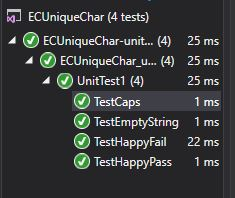

## Uniqueue Characters
We were offered extra credit to write the code for one of the mock interview questions. I chose uniqueue character question because I had previously written it using recursion, but we leared hashtables since then so I think I could write it better now with hashtables.
To clarify the unique character question is that if given a string we are to determine if it is full of unique characters or not.

## Challenge
I utilized my previouly written hast table DLL.
I chose to iterate through the string and hash it, and if I run into a collision then I could check the value and if it matches then that means the string isn't full of unique characters.
We were told to assume spaces do not count and case sensative doesn't matter.
Doing it this way I have a Time Big O of N because worst case I would iterate through the entire string and there isn't a duplicate character. I have a space of Big O of N because I am using memory to add a new item in the hashtable, and worst case is that I am adding each chara into the hashtable.

## Solution
Just for grading ease, proof of passing tests
