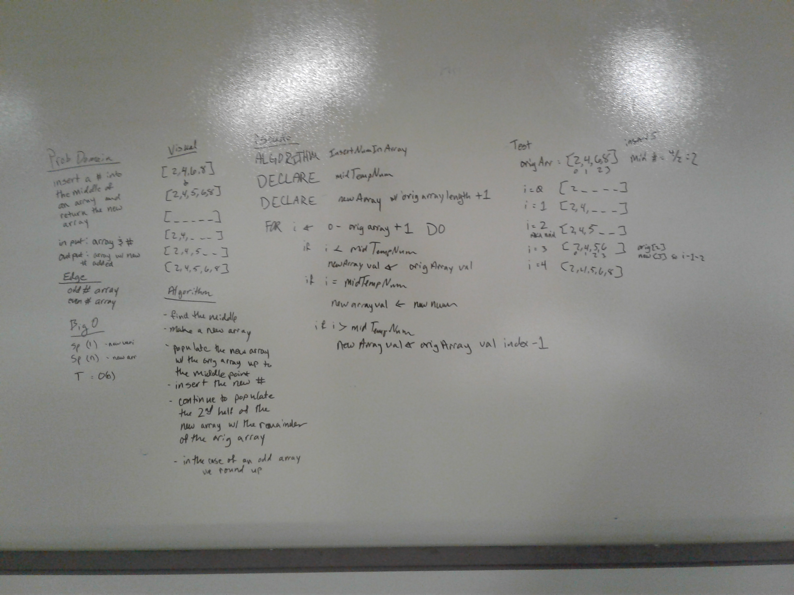

# First-in, First out Animal Shelter.
We were taksked to simulate an animal shelter.

## Challenge
We needed to keep the order animals "came" into the shelter.
We needed to be able to "adopt" animals per "customer's" preference

Like if we had gained a Dog (Ben) first and then a Cat (George) in the shelter, and Sally came in looking for a Cat, we would be able to give her the first cat we received. (George)
We were supposed to return null if we didn't have the animal they were looking for. Like if we only had dogs left in the shelter, and Sally was looking for another cat for George, then we would return null

## Approach & Efficiency
We chose to have two queues in our shelter. One to keep track of all the animals, and a second to temporaily move animals to if it wasn't the answer the person was looking to adopt.
Technically, it is Space Big O(1) because I didn't add a queue, it came prebuilt into the class
Time is Big O(N) because worst case I look through the entire queue trying to find the wanted animal

## Features
I made the following classes: 
- Animal, so we could have just Dogs or Cats in the Shleter
- Animal Node because the standard node held an INT, and I needed it to hold an Animal
- Animal Queue because I needed the behavior of a queue but the standard queue was set up for nodes with INT types, so just made the queue to be able to handle Animal types
- Shelter Class, this was the ask. This has the logic to add an animal to the shelter, and to "adopt" and animal out (only if it matches what the customer wanted)

## Solution

## Collaborators
Xia Liu was my Partner for this challenge

