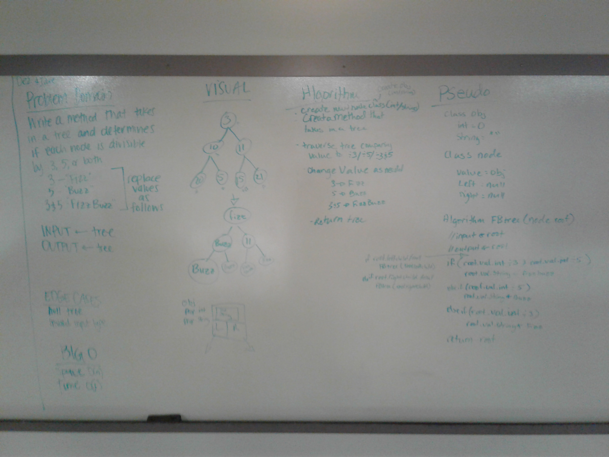
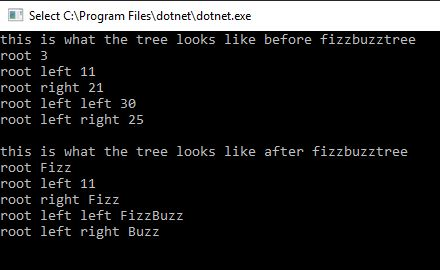

# FizzBuzz Tree
We were tasked with given a tree to iterate through it and update their values to fizz, buzz, or fizzbuzz depending if it was divisible by 3, 5 or 3&5.

## Challenge
The challenge of this was that we needed to utilize int for the math, but we needed to ba able to utilize strings to return a tree with fizz, buzz, fizzbuzz as appropriate.

## Approach & Efficiency
I used Big O(n) for time because I had to interate all the ndes
I used Big O(1) for space because I didn't create any additional nodes/variables.

## Solution

## Contribuitor
Partnered with Deziree Teague