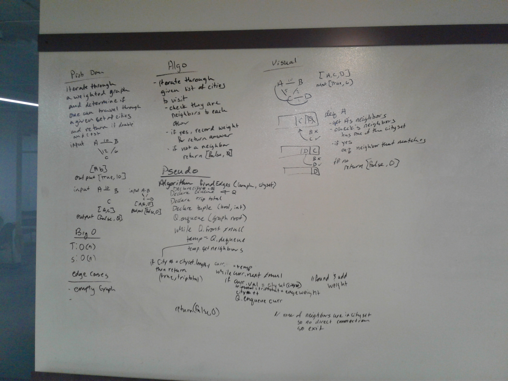

# Find Edges
We were asked if we were given a weighted graph and a set of nodes/cites/vertices/etc to determine if one could follow that set order on the graph, and if one could then to also return the weight of the the "trip"/path/etc

## Challenge
The challenge of this was to traverse a graph and visit the nodes in a particular order and keep track of it's egde weights.

## Approach & Efficiency
I utilized my Graph DLL.
To solve this I chose to iterate through the tree with a modified breadth first traversal. So it was modified because it would only add the "neighbor" that was next on the set/path/etc

## Solution
Whiteboard for getedges
