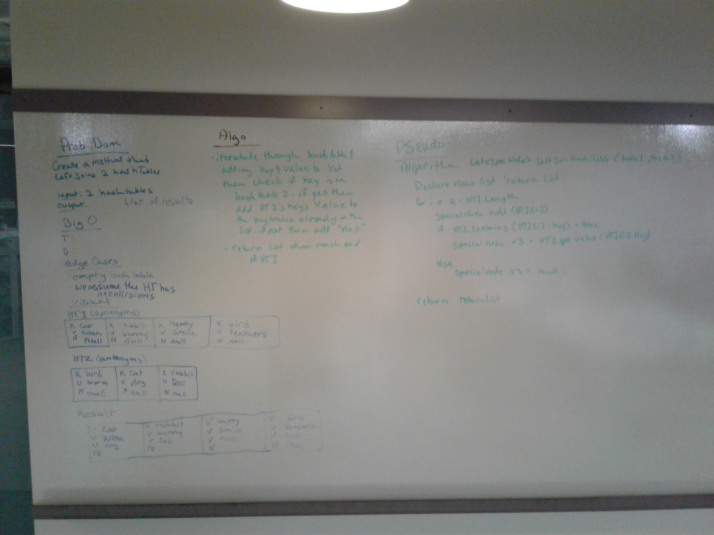

# Hashmap LEFT JOIN
Left join will find and return all data in the left "table" (Dictionary in our case) and the values from the right "table" if it matches the key from the left table. 

## Challenge
We were tasked with writing a method that performs the left join with two hashmaps. 

## Approach & Efficiency
It is assumed there are no collisions in either hashmaps. 
Otherwise, I iterated through the first hashmap and added the key and value to a list of objects that I will return. Before I move on to the next value in the left hashmap, I check if the right table contains that Key, if it does then I add it's value to the object, otherwise I return null
This has a time of Big O(m^n) where n is the left hashmap and m is the right hashmap, because at worst case I am iterating m times through the right hashmap for each n, and I have to iterate through all the n times in the left hashmap.
The space Big O is O(n) because I would need to create an object for each item n item in the laft hashmap.

## Solution
Here is the whiteboard for this challenge.
