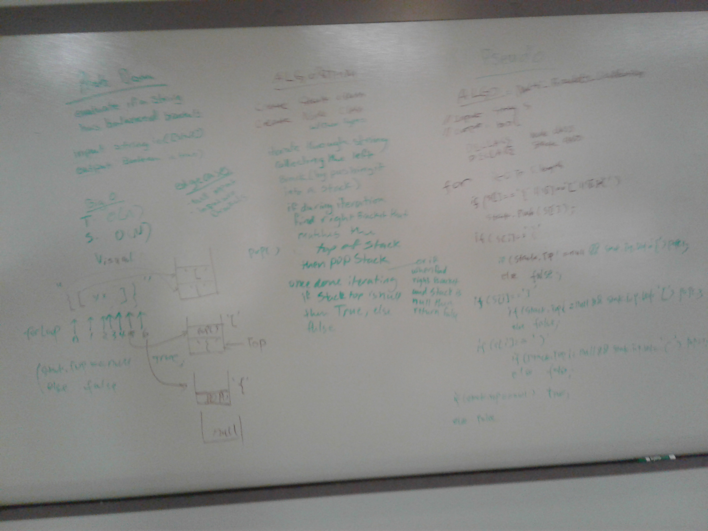

# Multi-bracket Validation.
We were tasked to take in a string and determine if it had balanced brackets

## Challenge
The challenge was determining the correct order, like [(]) isn't a balanced even though they all paired by the end

## Approach & Efficiency
We chose to create a node and stack that would take char types. If we found a left bracket we pushed it into the stack, if we came across a right bracket we then compared it to what was on top of the stack (because then they would be balanced correctly)
This would be Big O(n) for time because worst case we would walk the entire length of the string, and Big O(n) for space because we created stacks and nodes

## Solution

This is what it would look like if you ran the program

This shows my tests passed
