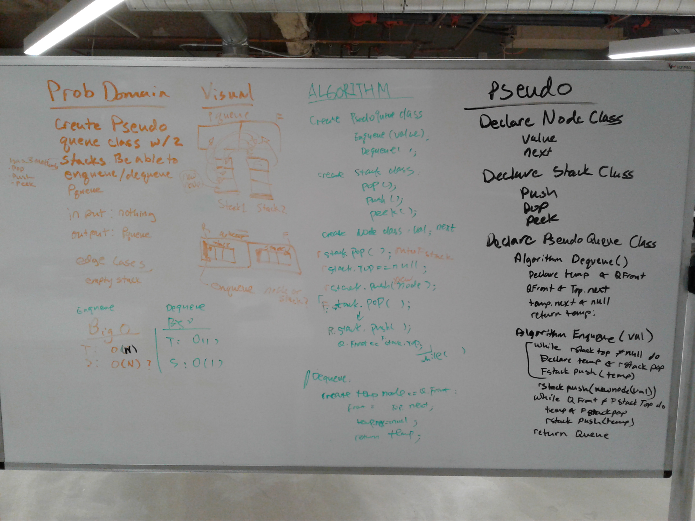

# Implement a Queue using two Stacks.
We were to create a PseudoQueue class that is made up of two stacks and simulates how a queue behaves.

## Challenge
The major challenge of this was the Queues's dequeue because the "end" was at the bottome of the stack.

## Approach & Efficiency
We chose a push on and pop off method. we would push items into a queue (enqueue) and if we were to dequeue, since it is at the bottom of the stack, we would utilize the second stack and flip the first stack over.
This would be Time O(n) because it would have to pop on and off all the nodes in the stack at worst case scenario.
Space is O(1) because we would only create a new node

## Solution
Whiteboard (I ended up coding a different solution from our original whitebaord)

## Collabortation
Partnered with Xia Liu

