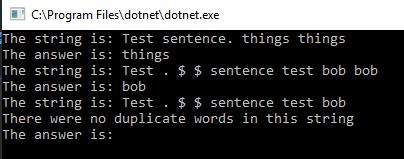
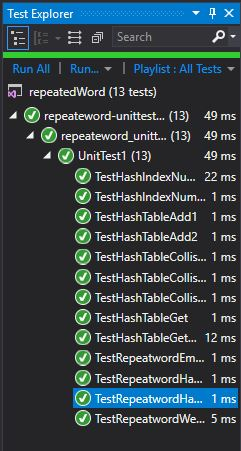

# First repeated word
Repeated Word takes in a string and will return the first word that is repeated.

## Challenge
The challenge was to break up the string into an array, so we could iterate through the words.

## Approach & Efficiency
I pulled in my DLL from my HashTable "lab/code challenge" we did in the course, because I wanted access to the nodes and linked lists I had revised to key value pairs. I then made a modified hash algorithm because I wanted to make it more realistic and a better hash (larger dictionary and less collisions for different keys). 
I chose to use split to change the string to an array or just the words (I used split with regex to get rid of the other characters like whitespace and special characters). I then iterated through the array and checked if the word was in the Dictionary. If it wasn't then I hashed it.
I assumed DOG is not the same word as dog, because my algorithm was based on ascii characters and capital letters are different than lower case letters.

For these choices, my Time Big O is O(N^2 because I split the string, then I iterated through the array. At worst case I would look at all the items because there are no duplicates.
Then my Space Big O is O(N) because I created new memory space for the array, and technically the Dictionary.

## Solution
This was the white board thoughts to help get me to my solution.

This is what the console looks like: 

This is for your convenience my tests all passed.

## Contribution
- Got help for hash code from stack overflow: https://stackoverflow.com/questions/400733/how-to-get-ascii-value-of-string-in-c-sharp/400738 
- Got help for split from: https://docs.microsoft.com/en-us/dotnet/api/system.string.split?view=netframework-4.7.2
