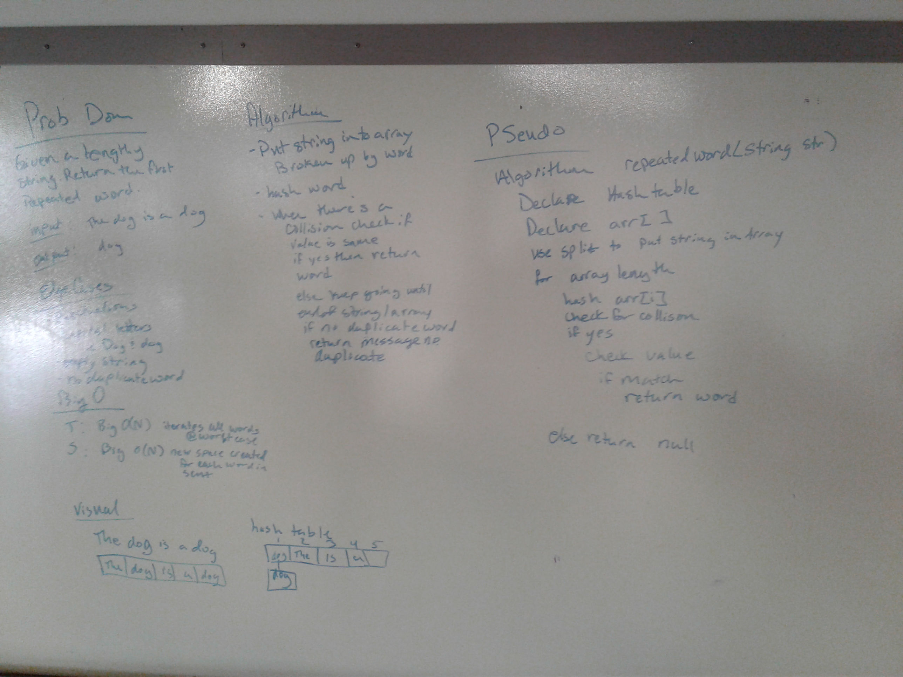

# First repeated word
<!-- Short summary or background information -->

## Challenge
<!-- Description of the challenge -->

## Approach & Efficiency
<!--
note that I pulled in my hashtable DLL so i could get to KV ndoe and KV linkedlist. But I re-wrote the hash table so I had a better hash.

comment assumed on white space, amanda said not to worry about puncuation
comment I assumed DOG was different than dog

What approach did you take? Why? What is the Big O space/time for this approach? -->

## Solution

<!-- Embedded whiteboard image -->

## Contribution
<!--
Got help for hash code from stack overflow: https://stackoverflow.com/questions/400733/how-to-get-ascii-value-of-string-in-c-sharp/400738 
got help for split from: https://docs.microsoft.com/en-us/dotnet/api/system.string.split?view=netframework-4.7.2

--> 