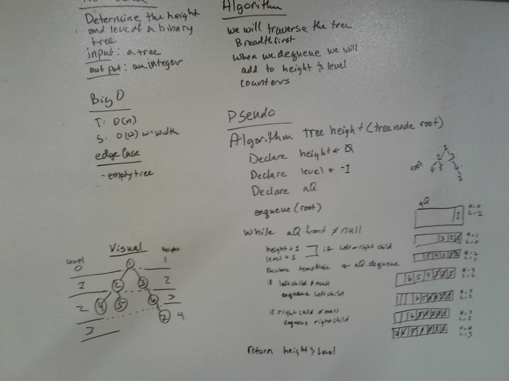
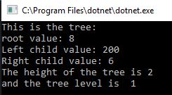
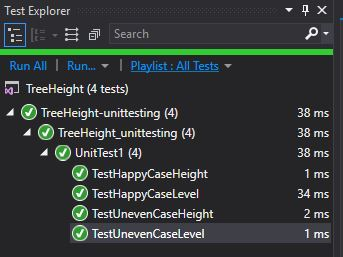

# Find Height of a Binary Tree
We were asked to write a method that determines the height of a binary tree

## Challenge
I originally chose breadth first over depth first because I worried with the recursion of the depth first method woudl reset variables.
Breadth first is reading nodes in a tree from top to bottom left to right (on each level) 
However at Amanda's high encouragement I refactored it be depth first. 

## Approach & Efficiency
I added my dll from BreadthFirstTraversal to utilize the nodes/queues previously written.
I put each level into a queue, then added to the height counter if the root had children otherwise I was counting all the nodes instead of each "roots", and enqueued it's children
(for breadth) For time, it was Big O(n) because we would walk through all the nodes.
(for breadth) For space, it was Big O(w) where W is width, the width of the tree.
(for refactored depth) For time, it was Big O(n) because we would walk through all the nodes.
(for refactored depth) for space, it was Big O(h) where h is the height of the call stack because I used recursion.

## Solution
WhiteBoard: 

Console: 

Tests:
