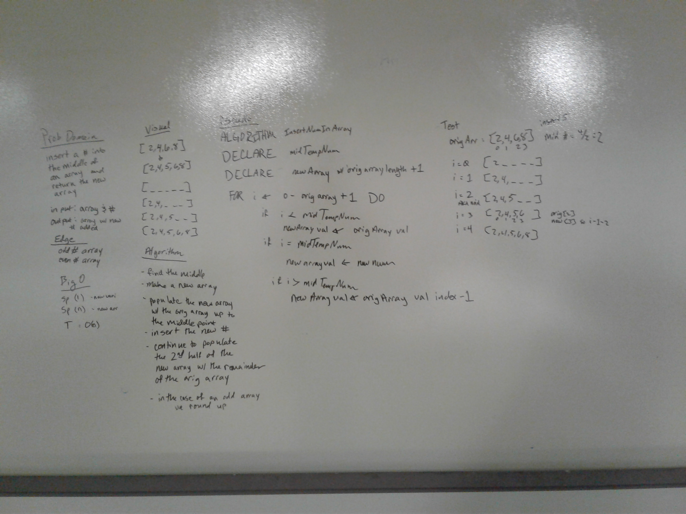

# Insert and shift middle index of array
I worked with Jason Few for the whiteboarding

## Challenge
We were tasked with inserting a given number into the middle of a given array. 

## Approach & Efficiency
We chose to create a new array which has a Big O of O(n) because in C# we cannot modify the length of a defined array, so to increase the length we needed a new one.

## Solution

_

