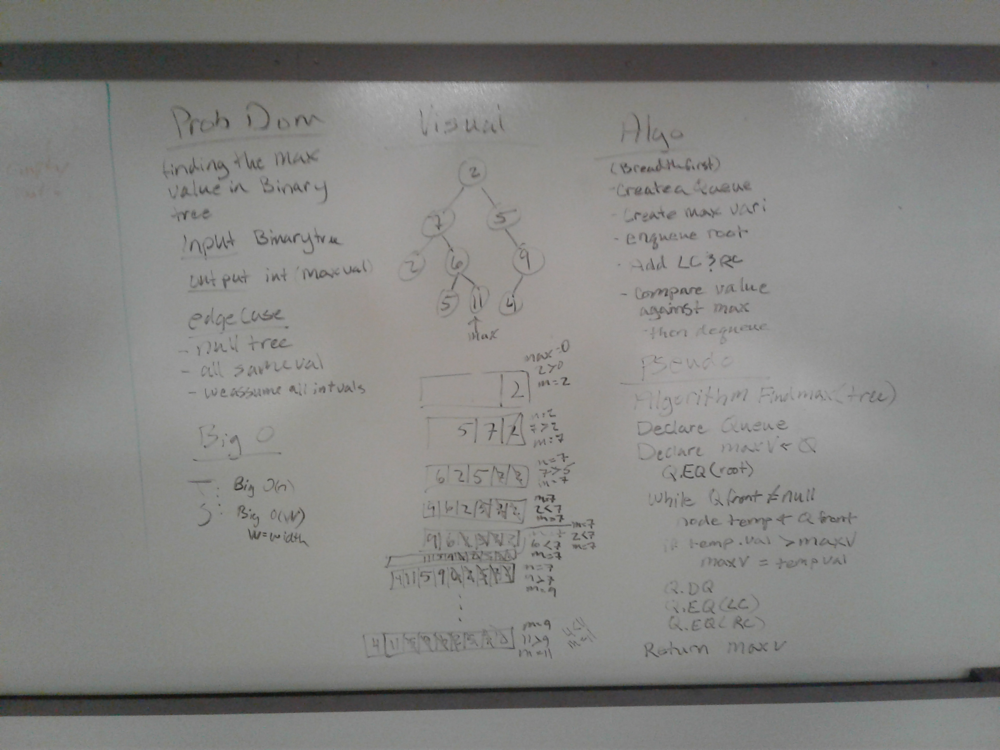
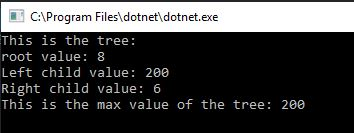

# Find Max Value in Binary Tree
We were asked to write a method that determines the max value in a binary tree

## Challenge
We chose breadth first over depth first because we worried with the recursion of the depth first method woudl reset variables.
Breadth first is reading nodes in a tree from top to bottom left to right (on each level) 

## Approach & Efficiency
I added my dll from BreadthFirstTraversal to ustilize the nodes/queues previously written.
We put each level into a queue. We compared each "root" node and dequeued it, and enqueued it's children
For time, it was Big O(n) because we would walk through all the nodes.
For space, it was Big O(w) where W is width, the width of the tree.

## Solution
WhiteBoard: 

Console: 

Tests:

## Contribuitor
Partnered with Deziree Teague
