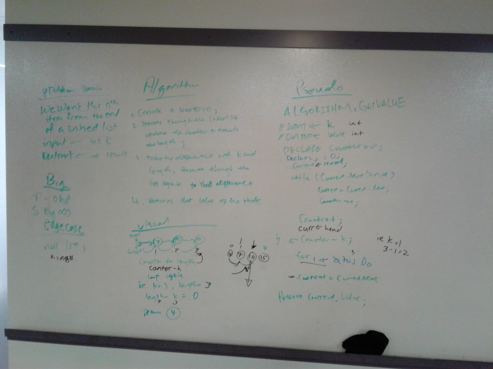
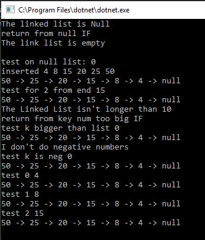
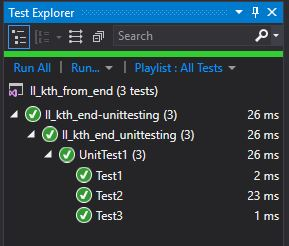
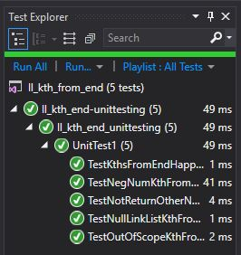

# Linked List: Kth from End

We were tasked to write a method where we could find the value of the Kth value from the end of a linked list.

# Approach and Efficiency

We chose this method to walk through the link list and then walk through it again to the difference from the length and K value. 
This would give us a Big O(n) for time because worst case we walk through all the items.
This would give us Big O(1) for space because we created two variables.

# Solution
WhiteBoard

<!-- if I want to use my insert idea-->
Console output

added a few more test

# Contributions
Partner for CC7: Xia Liu for whitebaord
TA Jimmy and Philip helped debug issues.
