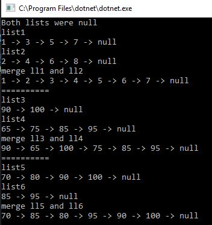
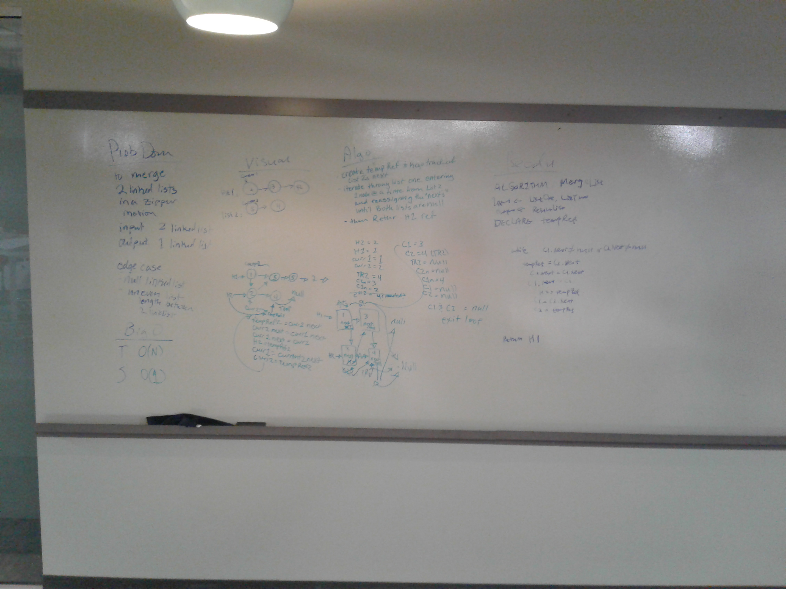
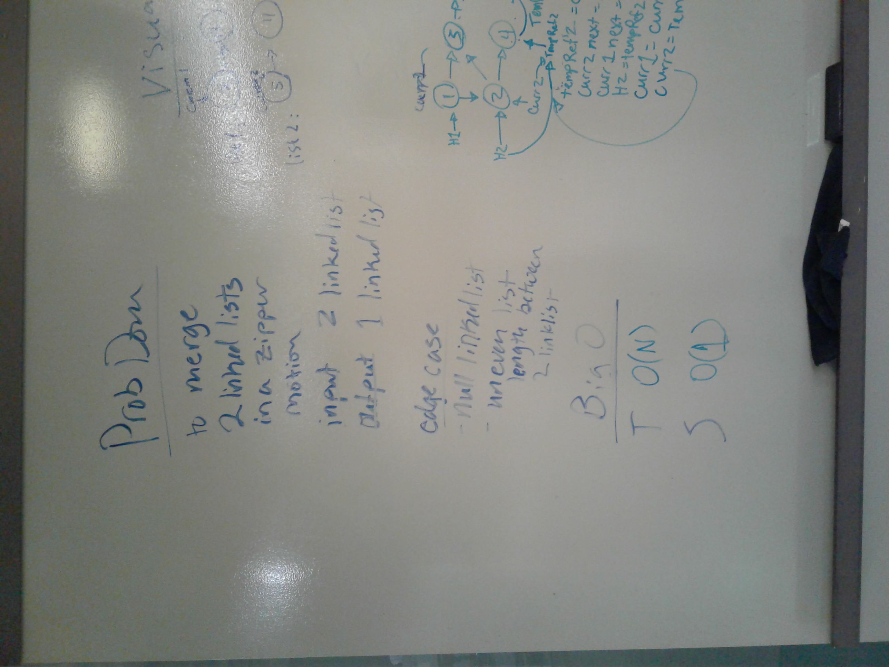
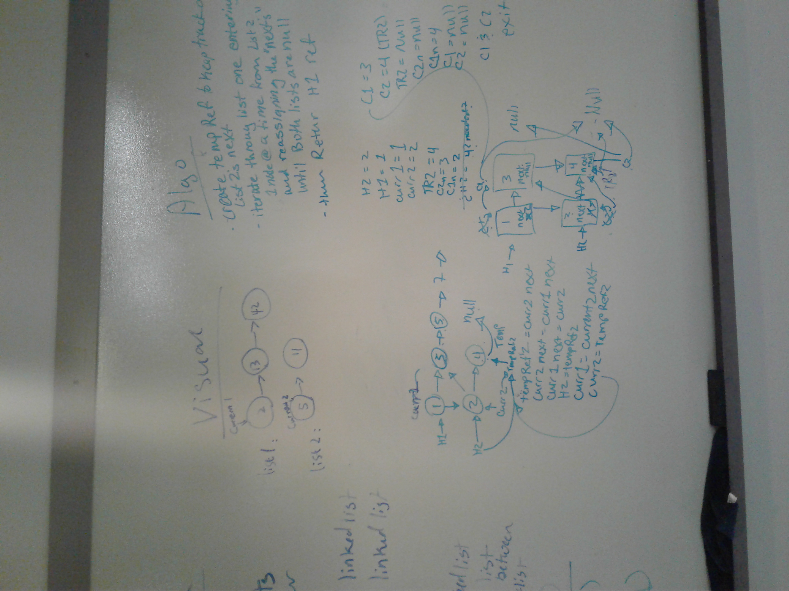
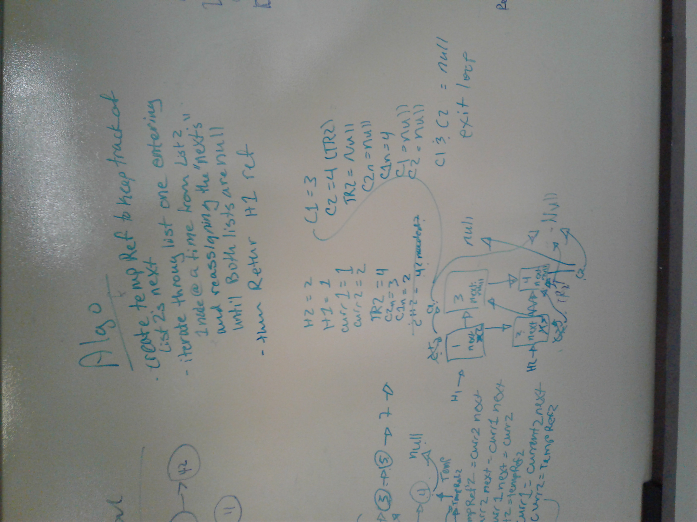
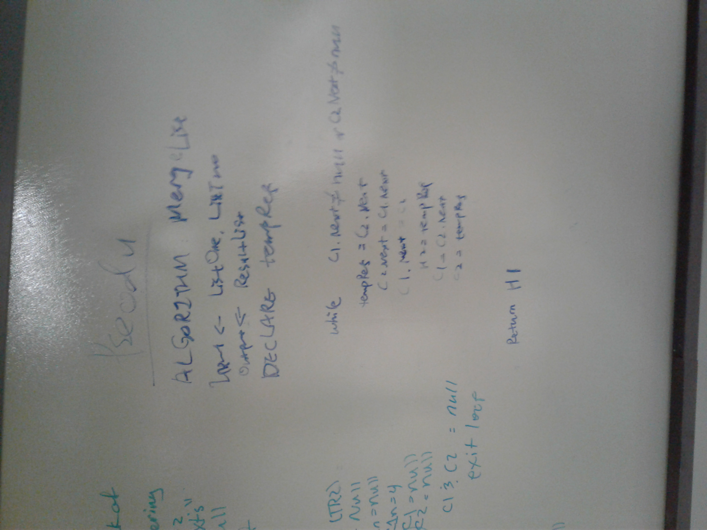

# Code Challenge 8

We were tasked with merging two linked lists together in a zipper style. (like one from one list, then one from the other list)

# Challenge
The challenge was to keep it space O(1)

# Approach and Efficency
The solution was to merge it into one list instead of creating a new list. This kept it at space O(1).

# Solution

Happy case when running program

Whiteboard

I also included closer up photos of the whiteboard because I felt it was tiny

Tests worked

# Constributors
Partner: Xia Liu

