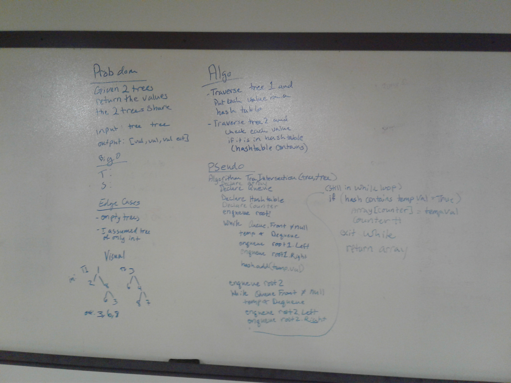

# Intersection of binary trees
We were asked to write a method that took in two trees and compare nodes from both to each other and return the values that were in both trees. 

## Challenge
We were asked if given two trees, to return all the numbers that appeared in both trees.

## Approach & Efficiency
I chose to iterate through one tree, I chose Breadth first because I use far too much time and space when I use recursion (maybe others don't but I do unfortunately) and hash each node value to a Dictionary.
Then I would iterate through the other tree (still using Breadth) and checked if that value was in the Dictionary, if it was then I added it to the list I am returning.
Finally I returned the list.
The way I chose to do this, I have Big O(N) for time because I would iterate through everything, and space has a Big(N) because worst case I need to add memory for each node because they are the same tree
I utilized my DLL from my BreadthFirstTraversal because it had the nodes and queues I needed for this.

## Solution
Here is my whiteboard for this challenge.
