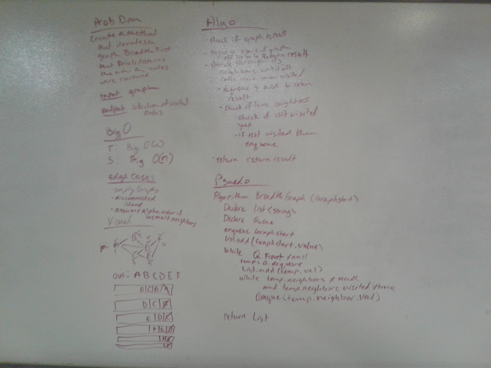

# Graphs
Graphs are non linear data structures that I will make up out of nodes.
<!-- Short summary or background information -->

## Challenge
We were asked to create a class for graphs represented as adjacency lists. 

## Approach & Efficiency
I utilized Lists for the graph and it was made up of nodes that acted like a linked list.
I created a new graphnode to hold the needed properties (value, if it has been visted, edgeweights and a next pointer)
I assumed the value would be of type int.

THe Big O depends on what you are doing:
- If I am adding, then time big o is n because I may have to traverse the entire list before adding. The space is O(1) for the new graphnode I create and add to the graph
- If I am adding an edge, time big o is O(n) because I would iterate through all the nodes looking for them to add the edge. Space is O(1) because I didn't create new space'
- If I am getting nodes, neighbors or size, then time is big O(n) because at worst I would iterate through all the nodes, and space is O(1) because I am not making/asking for any additional memory to return the information.

## API
The abilities of this class are: 
- AddNode: adds a node to the graph
- AddEdge: adds an edge between two nodes
- GetNodes: returns all the nodes in the graph
- GetNeighbors: returns the neighbors of a node
- Size: returns the number of nodes in the graph
- BreadthFirst: traverses through the graph and returns the order the nodes were checked/visited in

## Solution
Whiteboard for breadthfirst traversal
