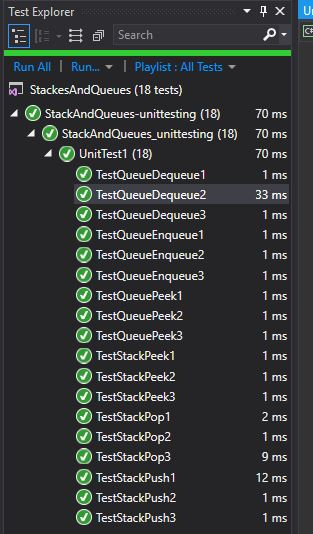

# Stacks and Queues
We are creating the classes for stack and queues, like a library to be used later like we did with Linked List

## Challenge
We were tasked to create a nodes, stacks, and queues class. For the stack and queues classes, we needed to add methods to add/remove from it and look at the "front/top" if it.

## Approach & Efficiency
We found the front (or end) and added a node. Since they have pointers to these locations, we didn't need to traverse the stack/queue, so it is Big O(1)

## API
API's for Stacks
- Push (add node to stack)
- Pop (remove node from stack)
- Peek (look at whats at the top of the stack)

API's for Queues
- Enqueue (add a node to the back of the queue)
- Dequeue (remove a node from the front of the queue)
- Peek (look at whats at the front of the queue)

## Solution
only did tests, does nothing in the console

## Contributors
Amanda Iverson walked through Stack and queues in class
Jeff Martinez helped explaning why I didn't need to set the rear.next if the queue was empty, which then fixed 2 of my tests

