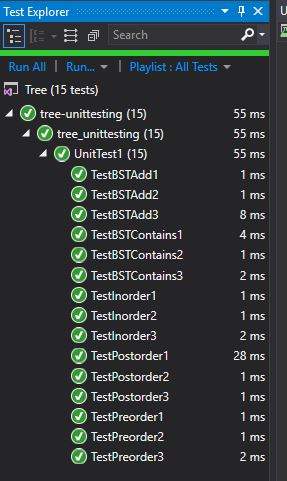

# Trees
We were asked to create nodes for a binary tree, a binary tree, and a binary search tree classes

## Challenge
- For the Nodes, we needed to contain the value and have a right and left child.
- For the binary tree class, we needed to be able to do a preOrder, inOrder and postOder interation
- For the binary search tree, we needed to be able to add a new node and check if the tree contained a node
	- This was particularly challenging because a binary search tree needs to be sorted as it is added. Therefore making searching it later faster.

## Approach & Efficiency
Binary preOrder/inOrder/postOrder has a Big O(n) (also known as Big O(h) where H is the height of the stack) because at worst it would need to look at each node, space would be Big(1) because we aren't allocating additional space.
Binary Search tree add and contain were Big O(logn) because with each "level" we could eliminate half the list to look through. (because it is sorted)

## API 
Details of these classes and their menthods: 
Binary tree: 
- preOrder: takes in the root of the tree and returns an array of BinaryTreeNodes
- inOrder: takes in the root of the tree and returns an array of BinaryTreeNodes
- postOrder: takes in the root of the tree and returns an array of BinaryTreeNodes
Binary search tree: 
- add: takes in the root of the tree and the value of the node you would like to add
- contains: takes in the root of the tree and the value of the node you are searching for, will return a boolean.

## Solution
