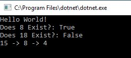
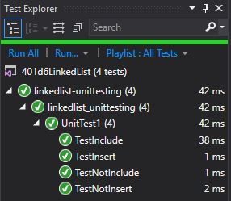

<!--
1-14-19 9:00-11:00

-->

# Singly Linked list Code Challenge

We were asked to start the code for linked lists. To create a linked list, and be cautious of a null list. A way to insert a new node in a linked list, a way to search the linked list for a particular value of a node, and a way to print the linked list.

## Approach and Efficiency

## API

## Contributors

Amanda Iverson provided us with starter code

## Solution

