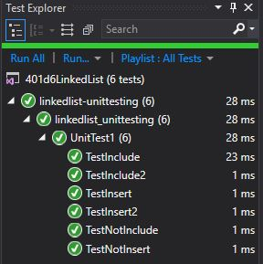

<!--
1-14-19 9:00-11:00
1-14-19 8:00 - 10:30

-->

# Singly Linked list Code Challenge

We were asked to start the code for linked lists. To create a linked list, and be cautious of a null list. A way to insert a new node in a linked list, a way to search the linked list for a particular value of a node, and a way to print the linked list.
We were then asked to add an Appends, InsertAfter, and InsterBefore.

## Approach and Efficiency

- It is Big O(1) when inserting at beginning, changes to big O(n) when inserting anywhere aside from beginning because worst case you could have to walk through whole list to add it at end
- It is Big O(n) when priting because it walks through all the nodes.
- It is space is O(1) because we aren't adding any new linkedlist (adding nodes is a constant so it is still O(1))

## API

The current APIs of this class are: 
- Insert
- Includes
- Print
- Append
- InstertBefore
- InsertAfter

## Contributors

Amanda Iverson provided us with starter code.

## Solution

