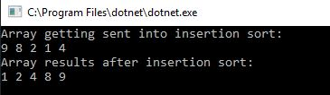
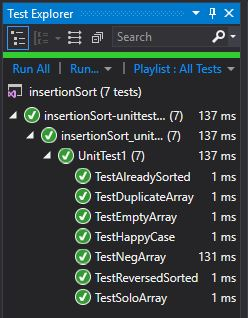

# Insertion Sort
Insertion sort is a sort that will find the place a data point should go and then insert it. Compared to other sorts that may just enter the data point and then switch it with the next item until it is in the correct location.

## Challenge
We were asked to write a method that took in an array (which may or may not be sorted, we assumed it would come in unsorted) and sorted it using insertion sort and return the sorted array.

## Approach & Efficiency
I chose a "for loop" with a 'while loop' to iterate through the data and find it's correct location in the array.
This caused it to have a time of Big O(n^2) because at the worst, when the array is reversed, it would need to iterate through the whole array to grab a data point to compare, but also iterate through the whole array to find it's correct spot.
As well as the way I did it, it caused me to have a space of Big O(n) because on each iteration I created a new variable, so i used n variable space.

## Solution
Here is what the console looks like

Here shows it passes its tests
